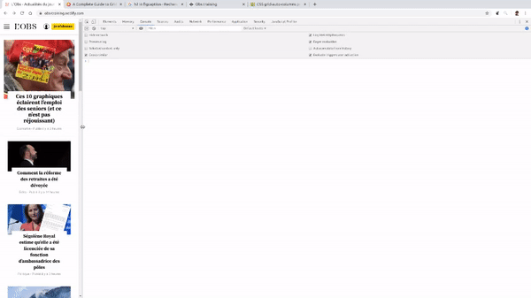
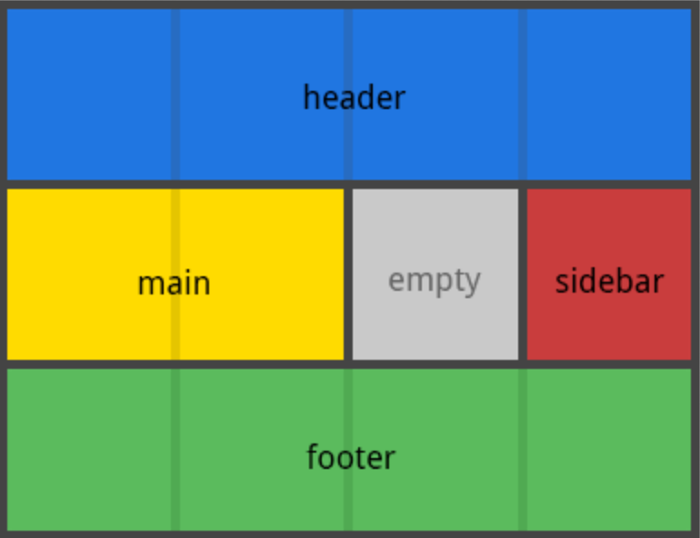

# Modern responsive part 3 : layout

Dans le dernier TP de cette série, nous allons intégrer une page web étape par étape en utilisant intelligement flexbox et grid.

La page à intégrer est [une version simplifiée du site de l'Obs](https://obs-training.netlify.com/).



L'ouverture du menu et de la recherche ne font pas partie des objectifs.

Les images et fonts sont dans `src/assets`.

_Note : il est inutile de se fier au code source du site modèle en l'inspectant : le but ici est de créer une version plus simple, utilisant des technologies plus modernes._

## Étape 0 : mise en place

Comme à votre habitude (voir TPs précédents), préparez votre environnement de travail avec `npm`, `parcel` et `SASS`. N'oubliez pas de commiter votre travail à la fin de chaque étape.

## Étape 1 : Les media queries

Identifiez les _breakpoints_ (dimensions de l'écran auxquelles la mise en page change). La taille la plus petite qu'on souhaite supporter sera `320px`. Partez de cette largeur, puis agrandissez le viewport pour détecter les 2 _breakpoints_ principaux. Notez la taille.

_Note : le header contient plus de variations, ignorez pour l'instant._

Dans un fichier `medias.scss`, définissez des mixins pour vos _media queries_. En _mobile first_, on part du plus petit pour aller vers le plus grand :

```
@mixin medium {
  @media (min-width: ???px) {
    @content;
  }
}

@mixin large {
  @media (min-width: ???px) {
    @content;
  }
}
```

Puis importez ce fichier de configuration dans votre fichier `scss` principal (celui qui est inclus par `index.html`) :

```
@import "config/medias";
```

Vous pouvez maintenant écrire votre code responsive ainsi, faites le test :

```
body {
  background-color: green;

  @include medium {
    background-color: yellow;
  }

  @include large {
    background-color: red;
  }
}
```

Ces mixins vous permettent de voir en coup d'oeil ce qui arrivera à votre élément en fonction de la taille de l'écran, c'est très lisible. Par ailleurs, vous n'aurez jamais à répéter un sélecteur : les _media queries_ sont incluses dedans, et non l'inverse (CSS classique).

## Étape 2 : le squelette

Commencez à analyser la page modèle. Que voyez-vous ?

On peut distinguer trois parties principales, que vous pouvez retranscrire dans votre html.

```
<body>
  <header class="header"></header>
  <main class="main"></main>
  <footer class="footer"></footer>
</body>
```

_Note : les classes semblent redondantes par rapport aux balises, mais elles vont nous permettre d'utiliser la convention BEM. Par ailleurs, un document peut contenir plusieurs `header`, `main` et `footer`, il serait donc risqué de se baser sur le nom des balises._

Les trois éléments pourront avoir chacun leur fichier de style, à inclure au fichier principal :

```
@import "blocs/header";
@import "blocs/main";
@import "blocs/footer";
```

_Note : ces trois blocs BEM sont très grands (surtout `main`). Ils vont donc contenir d'autres blocs BEM plus réduits (`article`, `info`...)._

## Étape 3 : la grille

Sur le site modèle, observez le `main`, c'est à dire tout le site à l'exception du `header` et du `footer`. Voyez-vous la grille ? Vous pouvez déjà mettre à jour le code :

```
.main {
  display: grid;
}
```

Commencez par analyser la grille dans sa forme la plus complexe : en écran large. Combien voyez-vous de lignes et de colonnes ?

_Rappel : actuellement en CSS, seuls les enfants directs peuvent être positionnés dans la grille. Vous devez donc ignorer les "sous-grilles" potentielles._

Avec un papier et un crayon, faites un schéma de la grille. Essayez de trouver les six enfants et de les placer sur votre schéma. Voici le genre de schéma dont on parle (même si dans notre cas, le header et le footer ne font pas partie de la grille) :



Dans le cas de notre site modèle, on pourrait appeler le premier enfant `primaryInfo`. Il se situe sur la première ligne, et sur les deux premières colonnes.

Mettez à jour votre HTML en conséquence :

```
<main class="main">
  <section class="main__primaryInfo primaryInfo">hello !</section>
  ...les cinq autres enfants...
</main>
```

_Note : la `section` est à la fois un enfant de main (donc `main__primaryInfo`), qu'on pourra ainsi placer dans la grille, mais aussi un bloc à part entière (donc `primaryInfo`), qui aura son propre fichier de style._

Diminuez votre viewport pour atteindre la taille intermédiaire. Vous pouvez constater que `main` n'est plus une grille : si on considère **uniquement** les six enfants précedemment établis, les éléments sont placés naturellement dans le flux, de haut en bas. Cela peut être traduit ainsi dans le code :

```
.main {
  @include large {
    display: grid;
  }
}
```

_Note : Les "sous-grilles" seront traitées plus tard dans le TP._

À vous désormais de configurer la grille pour obtenir une mise en page fidèle au site modèle. N'oubliez pas que vous avez d'[excellentes documentations](https://css-tricks.com/snippets/css/complete-guide-grid/). Voici une structure de base si vous avez besoin d'aide :

```
.main {
  @include large {
    display: grid;
    grid-template-columns: ???;
    grid-template-rows: ???;
    grid-template-areas: ???;
  }
}

.main__primaryInfo {
  background: yellow; /* Pour tester */
  height: 100px; /* Pour tester */

  @include large {
    grid-area: ???;
  }
}

```

Voici le style de résultat attendu, ici pour une grille complètement différente (la vôtre sera plus simple):


## Étape 4 : encore des grilles ?

Deux autres grilles sont identifables dans le site modèle, à des niveaux plus profonds. Ces deux grilles sont cette fois-ci actives sur les écrans larges **et** intermédiaires.

Identifiez-les et refaites le même exercice : schéma sur papier, puis mise en place du code, **responsive inclus**.

_Rappel : un élément de grille peut lui-même être en `display: grid`._

## Étape 5 : les blocs

Tout est en place pour passer à l'intégration détaillée, bloc par bloc.

Quand vous abordez un bloc, commencez par écrire son HTML. Par exemple :

```
<section class="main__primaryInfo primaryInfo">
  
  <h2 class="primaryInfo__title">Ces 10 graphiques éclairent l'emploi des seniors (et ce n'est pas réjouissant)</h2>
  <p class="primaryInfo__meta">Économie - Publié il y 2 heures</p>
</section>
```

Puis passez au CSS, toujours en _mobile first_ et en utilisant les _mixins_.

Quelques infos supplémentaires :

- Vous devrez déclarer les fonts (disponibles dans le dossier `src/assets/fonts`). Utilisez pour cela un fichier `fonts.scss` et les déclarations `@font-face`.
- Si des valeurs semblent se répéter (tailles de typos, couleurs...), utilisez des variables CSS stockées dans `css/config` pour les ré-utiliser dans les fichiers de bloc.
- Vous pouvez également déclarer des styles globaux (`font-family` et `color` du `body` par exemple), dans un dossier de style `global`, en organisant les fichiers selon ce qui vous semble le mieux.
- Certains sous-blocs se ressemblent ? Pensez aux _modifiers_ BEM (par exemple l'info principale et les cinq infos secondaires).

Bonne chance !
